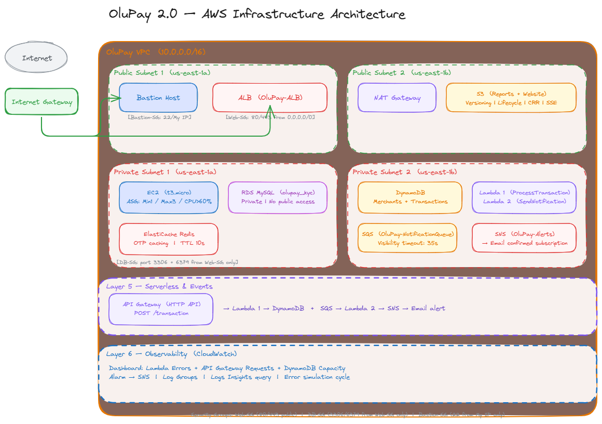

# OluPay 2.0 — Cloud Infrastructure

Nigeria has a salary day problem.

Every 25th of the month, millions of workers get paid at the same time. 
They open their banking apps simultaneously. Systems crash. Transfers 
fail. People can't access their own money.

OluPay grew from 400,000 to 2 million users. The old infrastructure 
couldn't handle it. This repository documents the rebuilt AWS 
infrastructure designed to survive salary day without anyone manually 
touching a server.

## What's running under the hood

The architecture spans six layers:

**Network foundation** — A custom VPC with four subnets spread across 
two availability zones. Public subnets face the internet. Private subnets 
hold everything sensitive. If one data center goes down, traffic 
automatically shifts to the other.

**Web tier** — EC2 instances sit behind an Application Load Balancer. 
An Auto Scaling Group watches CPU usage and quietly spins up more 
servers when salary day traffic hits 60% CPU. No manual intervention. 
No 3am panic.

**Storage** — S3 holds financial reports with versioning so nothing 
ever gets permanently deleted by accident. Lifecycle rules move older 
files to cheaper storage automatically. Everything replicates to a 
backup region in case of a regional outage.

**Databases** — RDS MySQL handles KYC identity records in a private 
subnet with no public internet access. DynamoDB serves the merchant 
transaction catalogue with single-digit millisecond reads. ElastiCache 
Redis caches OTPs so users aren't waiting on database round trips every 
time they authenticate.

**Serverless pipeline** — When a transaction comes in through the API 
Gateway endpoint, Lambda writes it to DynamoDB and drops a message on 
an SQS queue. A second Lambda picks that message up and fires an SNS 
notification. Payment processing and notifications are decoupled. If 
the email alert fails, the payment doesn't roll back.

**Observability** — CloudWatch monitors Lambda errors, API Gateway 
request rates, and DynamoDB capacity in a single dashboard. Alarms 
trigger SNS alerts the moment something breaks. Log Insights queries 
make it possible to find exactly what went wrong and when.

## Test it yourself

Send a transaction through the live API:

```bash
curl -X POST https://https://nwi8psk0j1.execute-api.us-east-1.amazonaws.com/transaction.execute-api.us-east-1.amazonaws.com/transaction \
  -H "Content-Type: application/json" \
  -d '{"transactionId":"TXN001","merchantId":"MERCH001","amount":50000}'
```

You should get a JSON response back in under a second confirming the 
transaction was processed. Check DynamoDB and you'll see the record 
sitting there. Check your inbox and the SNS alert will have arrived too.

## Architecture diagram


## Built with

AWS VPC | EC2 | ALB | Auto Scaling | S3 | RDS MySQL | DynamoDB | 
ElastiCache Redis | Lambda | API Gateway | SQS | SNS | CloudWatch | IAM

## About

Built during BaseStack AWS Cloud Accelerator Cohort 1 as a capstone 
project. The brief was simple: rebuild OluPay's infrastructure from 
scratch, justify every decision in both cost and security terms, and 
make it survive salary day.
